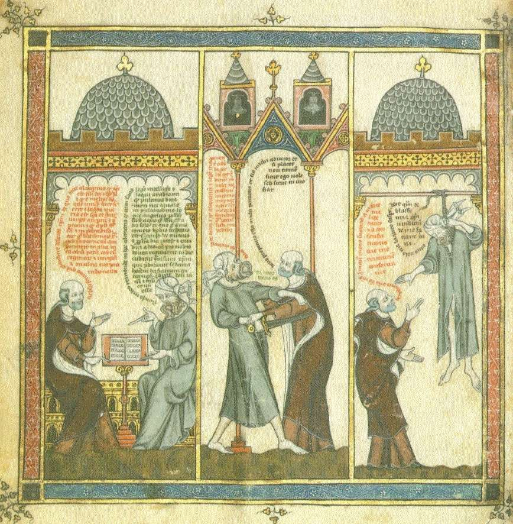

                    <h1 style="font-size:5vw">Breviculum: Vida Coetània de Ramon Llull</h1>  
                    
Còdex miniat que conté 12 il·lustracions de grans dimensions de la <i>
                        <a href="https://quisestlullus.narpan.net/vida-de-mestre-ramon">
                        Vita coetanea</a></i>,  executades cap a 1325 per iniciativa de Tomàs 
                        Le Myésier, un seguidor del beat vinculat a la cort de França.

                    <a href="mini_01.html">
                        
                         <b>Il·lustració I</b>
                    </a>
                    <a href="mini_02.html">
                        
                         <b>Il·lustració II</b>
                    </a>
                    <a href="mini_03.html">
                        
                         <b>Il·lustració III</b>
                    </a>
                    <a href="mini_04.html">
                        
                         <b>Il·lustració IV</b>
                    </a>
                    <a href="mini_05.html">
                        
                         <b>Il·lustració V</b>
                    </a>
                    <a href="mini_06.html">
                        
                         <b>Il·lustració VI</b>
                    </a>
                    <a href="mini_07.html">
                        
                         <b>Il·lustració VII</b>
                    </a>
                    <a href="mini_08.html">
                        
                         <b>Il·lustració VIII</b>
                    </a>
                    <a href="mini_09.html">
                        
                         <b>Il·lustració IX</b>
                    <a href="mini_10.html">
                        
                         <b>Il·lustració X</b>
                    </a>
                    <a href="mini_11.html">
                        
                         <b>Il·lustració XI</b>
                    </a>
                    <a href="mini_12.html">
                        
                         <b>Il·lustració XII</b>
                    </a>
                    
                    
Aquest projecte ha rebut el suport del 
                        Departament de Cultura de la Generalitat de Catalunya.

                    <a href="https://quisestlullus.narpan.net/breviculum/credits">
                        Credits and References</a>
